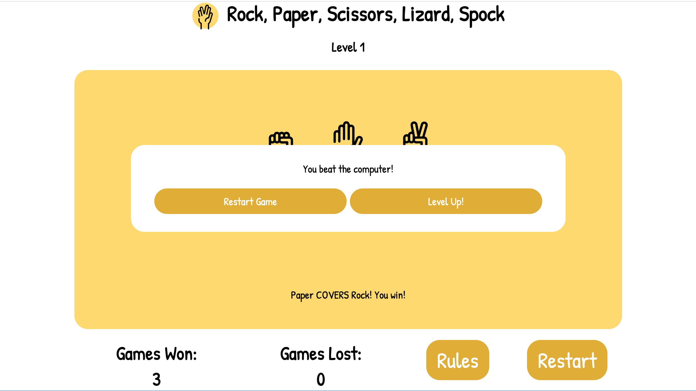
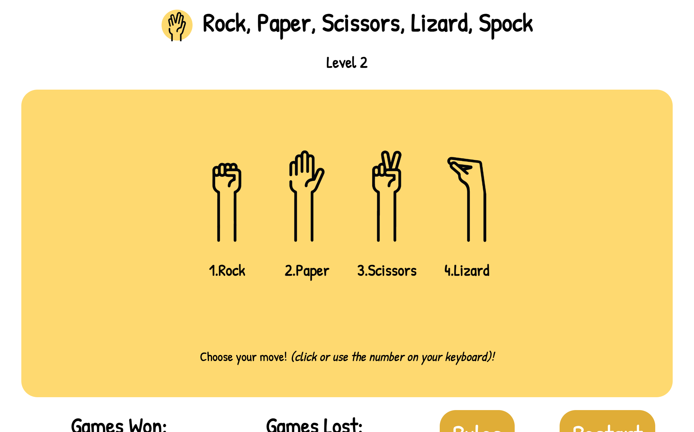
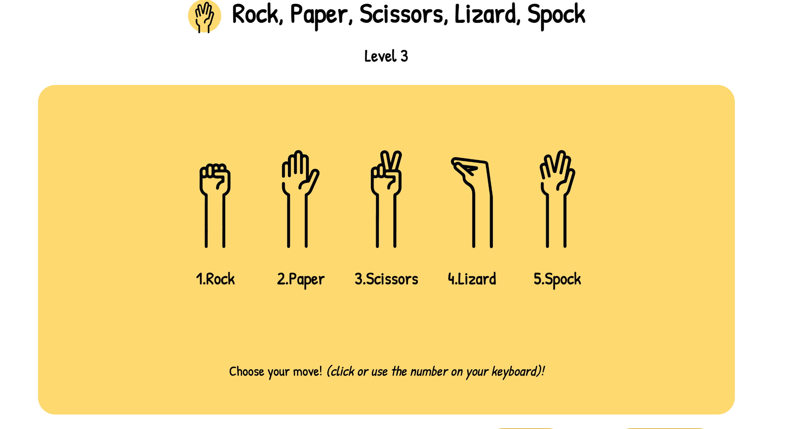

# Rock, Paper, Scissors, Lizard, Spock!

This website hosts a game for the user to play 'Rock, Paper, Scissors, Lizard Spock' against the computer. There are three levels; each level introduces a new move. Level one, includes moves 'Rock', 'Paper' and 'Scissors'. Level two introduces the move 'Lizard'. Level the three introduces move 'Spock'. 

## Mockup

The mock up for the website was create on Illustrator. 

### Icons
The original icons used for Rock, Paper and Scissors were sourced from the below website. 

https://www.flaticon.com/free-icon/rock-paper-scissors_4144475

I then used Adobe Illustrator to develop my own Lizard and Spock icons to create a consistent style for all my icons. the same colouring, stroke width, and arm length of each icon were all taken into consideration when these icons were in development. 

As seen above, the fav icon was also created at the same time to cultivate consistancy. 

All 5 icons were then used to create the rules diagram so the user has a pictoral visual of how to play the game. 

### Design

The layout and colours chosen were chosen to be internationally simple and clean. The three colours create a crisp and friednly asthetic. 

The rounded corners on the icons, match the font chosen as well as the rounded corners of the game area and buttons.  The overall game feel is soft, yet crisp. 

### Layout

The website layout was designed in Illustrtor. This enabled me to have a really realistic view of what the website could look like. 

As you can see by the markings on the background of the above image, I also used this layout to make out the different sections of the website. This really helped when it came to putting the website together and assigning classes and id's to different sections. 

## Edits

Once the website was actually being created, there were some changes made. 

Game Rules:
The rules of the game were set out in a tabel format and I decided to center the text instead of aligning it to the left.  This make the rules area flow much better and appeeared as one whole section of the page rather than information which was completely seperate to the diagram. 

Game Mesasge:
When the user first enters the game page, there isn't any instruction how to make a move against the computer.  I added a simple message below the icons to notify the user they can either click with their mouse on their move of choice, or they can use the corresponding number on their keyboard. Looking back this is definately something that should have been thought out in the designing process. 

Game Outcome Buttons:
It was decided that yellow, black and white were the main colours of the website. Having the buttons at the bottom of the game in blue felt too foreign to the look of the page. These buttons were chnaged to a darker shade of yellow. 

Scoring: 
The scoring of the game was initally only going to count the games the user lost. As the website developed, I created a leveling system and determined it to be a more positive experience for the user to see how many more games they needed to win before they could level up. 

## Features
The game has 3 levels. Each level can be achieved by winning three games against the computer.  If the user loses three games in the level, the lose score restarts to 0. They can then stay on the level until they achieve 3 wins before they achieve 3 loses. The level the user is on displays at the top of each page. 
When the user completes a level, a popup appears to let the user know.  The user then has the option to level up or restart the game. 

As mentioned above, the game tracks the score of the user depending on if they win or loose each round.  3 wins before 3 loses means the user gets to level up.

Each level introduces a new rule.  The game gets harder with each level as theres more chance for attach and there's more to defend.

The user plays the game against the computer. The computer automatically chooses their move based on the level the user is on. If the user only has asccess to rock, paper and scissors - then so does the computer. 

Dependent on what the user and computer play, an outcome message appears at the bottom of the game section. This message shows the user what move beat what move with what method; ie. "Lizard POISONS Spock". This is then followed by a message notifying the user who wins that round. 

### Future Features
- Allow the user to play against their friends (player 1 and player 2)
- A leaderboard
- New Levels with new rules
-